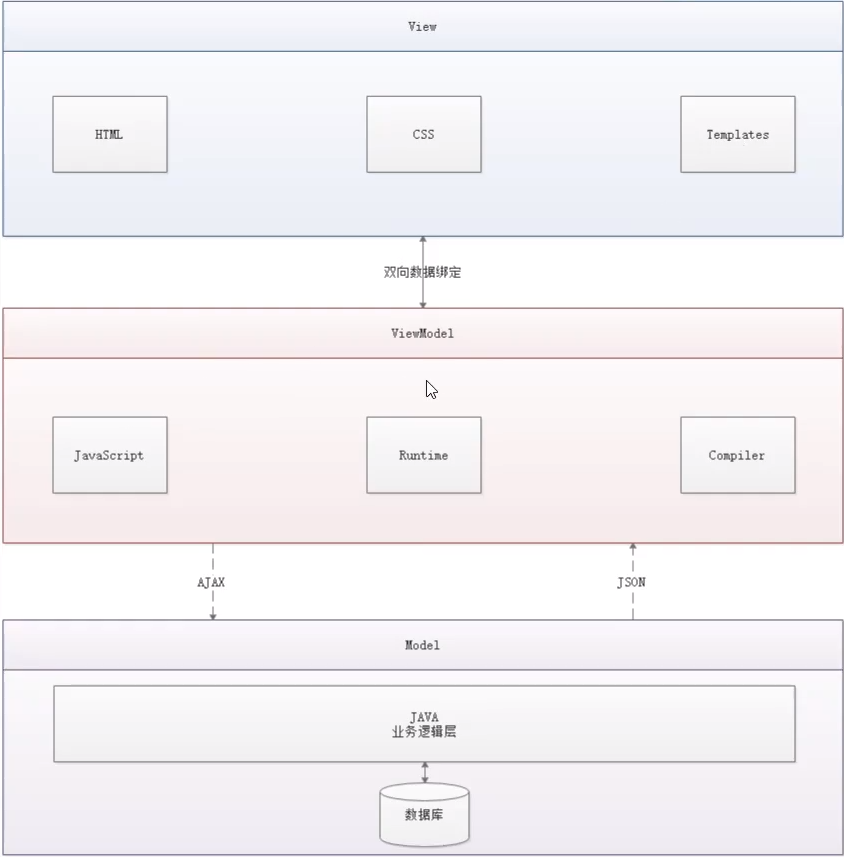
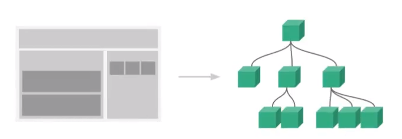

# Vue

## Vue：MVVM模式

### 什么是MVVM

* MVVM :
      MVVM(Model-View-ViewModel)是一软件设计模式，是一种简化用户界面的事件驱动编程方式
  
  

### 为什么需要使用MVVM?

​    MVVM 和 MVC 模式一样，主要目的就是分离视图(View)和模型(Model)，有以下几大好处：
​    (1) 低耦合：视图(View)可以独立于 Model 的变化和修改，一个 ViewModel 可以绑定到不同的 View 上，当 View 变化的
​        时候 Model 可以不用变，当 Model 变化的时候 View 也可以不变。
​    (2) 可复用：你可以把一些视图逻辑放在一个 ViewModel 里面，让很多 View 重用这段视图逻辑。
​    (3) 独立开发：开发人员可以专注于业务逻辑和数据的开发(ViewModel)，设计人员可以专注于页面设计。
​    (4) 可测试：界面素来是比较难于测试的，而现在测试可以针对 ViewModel 来写。

---

### MVVM的组成部分

* View :
  
* View 是视图层，也就是用户界面，主要由 html 和 css 来构建，为了方便地展示 ViewModel 和 Model 层的数据，已经产生了各种各样的前后端模板语言，比如：FreeMarker、Thymeleaf等等，各大 MVVM 框架如 Vue.js、AngularJS、EJS 等都有自己用来构建用户界面的内置模板语言。
  
* Model :
  Model 是指数据模型，泛指后端进行的各种业务逻辑处理和数据控制操控，主要围绕数据库系统展开。这里的难点主要在于需要和前端约定统一的 接口规则。

* ViewModel :
  ViewModel 是由前端开发人员组织生成和维护的视图数据层。在这一层，前端开发者对从后端获取到的 Model 数据进行转换处理， 做二次封装，以生成符合 View 层使用预期的视图数据模型。

  需要注意的是 ViewModel 所封装出来的数据模型包括**视图的状态和行为**两部分，而 Model 层的数据模型只是包含状态的。

  * 比如页面的这一块展示什么，那一块展示什么这些都属于视图状态(展示)
  * 页面加载进来发生什么，点击这一块发生什么，这一块滚动时发生什么都属于视图行为(交互)

---

* 视图状态和行为都封装在 ViewModel 里。这样的封装使得 ViewModel 可以完整描述 View 层。由于**实现了双向绑定**，ViewModel的内容会实时展示在 View 中，这是激动人心的，因为前端开发者再也不必低效又麻烦地通过操纵 DOM 去更新视图.
* MVVM 框架已经把最脏最累的一块做好了，我们开发者只需要维护 ViewModel，更新数据视图就会自动得到相应更新，实现真正的事件驱动更新。
* View 层展现的不是 Model 层的数据，而是 ViewModel 的数据，由 ViewModel 负责与 Model 层交互，这样完全解耦了 View 和Model 层，这个解耦是至关重要的，它是前后端分离方案实施的重要一环。

---

### Vue

* Vue 是一套用于构建用户界面的渐进式框架，发布与2014年2月。与其他大型框架不同，Vue被设计为可以自底向上逐层应用。Vue的核心只关注视图层，不仅易于上手，还便于与第三方库(如：vue-router、vue-resource、vuex)或既有的项目整合
* Vue 是 MVVM 模式的实现者
  * Model : 模型层，这里表示 JavaScript 对象
  * View : 视图层，这里表示 DOM(Html操作的元素)
  * ViewModel : 连接视图和数据的中间件，Vue.js 就是 MVVM 中 ViewModel 层的实现者
* 在 MVVM 框架中，是不允许数据和视图直接通信的，只能通过 ViewModel 来通信，而 ViewModel 就是定义一个 Observer 观察者
  * ViewModel 能够观察到数据的变化，并对视图对应的内容进行更新
  * ViewModel 能够监听视图的变化，并能够通知数据发生改变

* 至此，我们就明白了，Vue.js 就是一个 MVVM 的实现者，它的核心就是实现了 DOM监听 与 数据绑定。

## Vue基础语法

* v-if

  demo02.html

* v-for

  demo03.html

* v-on

  demo04.html

## Vue：表单绑定、组件

### 表单绑定

#### 什么是数据的双向绑定

* Vue.js是一个MVVM框架，即数据双向绑定，即当数据发生变化的时候，视图也发生改变，当视图发生改变的时候，数据也会跟着同步变化。这也是Vue.js的精髓之处了。
* 值得注意的是，我们所说的数据双向绑定，一定是对于UI控件来说的，非UI控件不会涉及到数据双向绑定。单向数据绑定是使用状态管理工具的前提。如果我们使用vuex，那么数据流也是单向的，这时就会和双向数据绑定有冲突。

#### 为什么要实现数据的双向绑定

* 在 Vue.js中，如果使用vuex，实际上数据还是单向的，之所以说是双向绑定，这时针对UI空间来说的，对于我们处理表单，Vue.js的双向数据绑定用起来就比较舒服了。即两者并不互斥，在全局性数据流使用单向，方便跟踪；局部性数据使用双向，简单易操作。

#### 在表单中使用双向数据绑定

* 可以使用 v-model 指令在表单 <input\>、<testarea\>及<select\>元素上创建双向数据绑定。他们会根据控件类型自动选择正确的方法来更新元素。尽管有些神奇，但v-model本质上不过是语法糖，它负责监听用户的输入事件以更新数据，并对一些极端场景进行一些特殊处理。
* **注意：v-model会忽略所有表单元素的value、checked、selected特性的初始值而是将Vue实例的数据作为数据来源。你应该通过JavaScript在组件的data选项中声明初始值。**

代码演示：demo05.html

### 组件

#### 什么是组件

* 组件是可复用的 Vue 实例，说白了就是一组可以重复使用的模板，跟JSTL的自定义标签、Thymeleaf 的 th:fragment 等框架有着异曲同工之妙。通常一个组件会以一颗嵌套的组件树的形式来组织：

  

* 例如，你有可能会有页头、侧边栏、内容区等组件，每个组件又包含了其他的像导航栏链接、博文之类的组件。

#### 第一个Vue组件

* 注意：在实际开发中，我们并不会用以下方式开发组件，而是采用 vue-cli 创建.vue 模板文件的方式开发，以下方法只是为了让大家理解什么是组件：

  参照demo06.html

#### 使用props属性传递参数

* 组件中需要传递数据，就需要用到这个属性
* **注意：默认规则下 props 属性里的值不能为大写；**