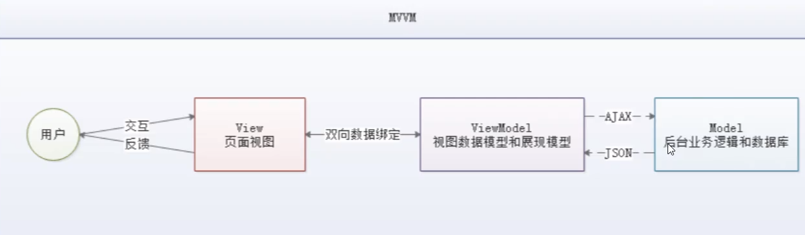

# Vue

## Vue: 前端体系、前后端分离

### 1、概述

* Vue是一套用于构建用户界面的**渐进式框架**，发布于2014年2月。与其它大型框架不同的是，Vue被设计为可以自底向上逐层应用。**Vue的核心库只关心视图层**，不仅易于上手，还便于与第三方库（如：vue-router:跳转，vue-resource:通信，vuex:管理）或既有项目整合。

* 官网：https://cn.vuejs.org/v2/guide/


### 2、前端知识体系

* 想要成为真正的“互联网Java全栈工程师”，还有很长的一段路要走，其中"大前端"是绕不开的一门必修课。本阶段的目的是让Java后台程序员认识前端、了解前端、掌握前端，为实现成为"互联网Java全栈工程师"再向前迈进一步。

#### 2.1、前端三要素

* HTML（结构）：超文本标记语言（Hyper Text Markup Language），决定网页的结构和内容
* CSS（表现）：层叠样式表（Cascading Style Sheets），设定网页的表现样式
* JavaScript（行为）：是一种弱类型脚本语言，其源代码不需要经过编译，而是由浏览器解释运行，用于控制网页的行为。

#### 2.2、结构层（HTML）

太简单，略。

#### 2.3、表现层（CSS）

* CSS层叠样式表是一门标记语言，并不是编程语言，因此不可以自定义变量，不可以引用，换句话说就是不具备任何语法支持，它的主要缺陷如下：
  * 语法不够强大，不如无法嵌套书写，导致模块开发中需要书写很多重复的选择器；
  * 没有变量和合理的样式复用机制，使得逻辑上相关的属性值必须以字面量的形式输出，导致难以维护。
* 这就导致了我们在工作中无端增加了许多工作量。为了解决这个问题，前端开发人员会使用一种称之为**【CSS预处理器】**的工具，提供 CSS 缺失的样式层复用机制、减少冗余代码，提高样式代码的可维护性。大大提高了前端在样式上的开发效率

#### 什么是 CSS 预处理器

* CSS 预处理器定义了一种新的语言，其基本思想是，用一种专门的编程语言，为 CSS 增加一些编程的特性，将 CSS 作为目标生成文件，然后开发者就只要使用这种语言进行 CSS 的编码工作。转换成通俗易懂的语言就是："**用一种专门的编程语言，进行Web页面样式设计，再通过编译器转化为正常的 CSS 文件，以供项目使用**"。
* 常用的 CSS 预处理编译器有如下：
  * SASS ：基于 Ruby，通过服务端处理，功能强大。需要学习 Ruby 语言，上手难度高于 LESS。
  * LESS ：基于 NodeJS，通过客户端处理，使用简单。功能比SASS简单，解析效率也低于 SASS，但实际开发中足够了，如果我们后台人员需要的话，建议使用 LESS。

#### 2.4、行为层（JavaScript）

JavaScript是一种弱类型脚本语言，其源代码不需要经过编译，而是将文本格式的字符代码发送给浏览器由浏览器解释运行。

* Native 原生 JS 开发

  原生 JS 开发，也就是让我们按照**【ECMAScript】**标准的开发方式，简称 ES，特点是所有浏览器都支持。ES标准已发布如下版本：

  * ES3
  * ES4（内部，未正式发布）
  * ES5（全浏览器支持）
  * ES6（常用，当前主流版本：webpack打包成ES5支持！）
  * ES7
  * ES8
  * ES9

* TypeScript 微软的标准

  TypeScript 是一种由微软开发的自由和开源的编程语言。它是 JavaScript 的一个超集，而且本质上向JavaScript上添加了可选的静态类型和基于类的面向对象编程。

  该语言的特点就是除了具备ES的特性之外还纳入了许多不在标准范围内的新特性，所以会导致很多浏览器不能直接支持 TypeScript 语法，需要编译后（编译成JS）才能被浏览器正确执行。

#### JavaScript 框架

* JQuery：大家熟悉的 JavaScript 库，优点是简化了 DOM 操作，缺点是 DOM 操作台频繁，影响前端性能，在前端眼里使用它仅仅是为了兼容IE6、7、8；
* Angular：Google 收购的前端框架，由一群 Java 程序员开发，其特点是将后台的 MVC 模式搬到了前端并增加了 **模块化开发**的理念，与微软合作，采用 TypeScript 语法开发；对后台程序员友好，对前端程序员不友好；最大的缺点是版本迭代不合理（如：1代 -> 2代，除了名字，基本就是两个东西）；
* React：Facebook 出品，一款高性能的 JS 前端框架；特点是提出了新概念 【**虚拟DOM】** 用于减少真实DOM操作，在内存中模拟 DOM 操作，有效的提升了前端渲染效率；缺点是使用复杂，因为需要额外学习一门**【JSX】**语言
* Vue：一款渐进式 JavaScript 框架，所谓渐进式就是逐步实现新特性的意思，如实现模块化开发、路由、状态管理等新特性。其特点是综合了 Angular（模块化）和 React（虚拟DOM）的优点。
* Axios：前端通信框架；因为 Vue 的边界很明确，就是为了处理 DOM，所以不具备通信的能力，此时就需要额外使用一个通信框架与服务器交互；当然也可以直接使用 jQuery 提供的 Ajax 通信功能。

#### UI 框架

* Ant-Design：阿里巴巴出品，基于 React 的 UI 框架
* ElementUI、iview、ice：饿了么出品，基于Vue的UI框架
* Bootstrap：Twitter 退出的一个用于前端开发的开源工具包
* AmazeUI：又叫"妹子UI"，一款 HTML5 跨屏前端框架

#### JavaScript 构建工具

* Bebel：JS编译工具，主要用于浏览器不支持的 ES 新特性，比如用于编译 TypeScript

* WebPack：模块打包器，主要作用是打包、压缩、合并及按序加载

  **注：以上知识点已将 WebApp 开发所需技能全部梳理完毕**。

#### 2.5、三端统一

* 混合开发（Hybrid App）

  主要目的是实现一套代码三端统一（PC、Android：.apk、IOS：.ipa）并能够调用到设备底层硬件（如：传感器、GPS、摄像头等），打包方式主要有以下两种：

  * 云打包：HBuild --> HBuidX，DClod出品：API Cloud
  * 本地打包：Cordova（前身是 PhoneGap）

* 微信小程序

  详见微信官网，这里就是介绍一个方便微信小程序 UI 开发的框架：WeUI

#### 2.6、后端技术

* 前端人员为了方便开发也需要掌握一定的后端技术，但我们Java后台人员知道后台知识体系极其庞大复杂，所以为了方便前端人员开发后台应用，就出现了 NodeJS 这样的技术。
* NodeJS的作者已经声称放弃 NodeJS（说是架构做的不好，再加上笨重的node_modules，可能让作者不爽了），开始开发全新架构 Deno
* 既然是后台技术，那肯定也需要框架和项目管理工具，NodeJS框架及项目管理工具如下：
  * Express：NodeJS 框架
  * Koa：Express 简化版
  * NPM：综合项目管理工具，类似于 Maven
  * YARN：NPM 的替代方案，类似于 Maven 和 Gradle 的关系

#### 2.7、主流前端框架

Vue.js

* iView

  iview 是一个强大的基于 Vue 的 UI 库，有很多使用的基础组件，比ElementUI组件更加丰富，主要服务于 PC 界面的中后台产品。使用单文件的 Vue 组件化开发模式，基于 npm+webpack+bebel开发，支持ES2015高质量、功能丰富友好的API，自由灵活地使用空间。

  **备注：属于前端主流框架，选型时可考虑使用，主要特点是移动端支持较多**

* ElementUI

  ElementUI 是由饿了么前端开源维护的 Vue UI 组件库，组件齐全，基本涵盖后台所需要的全部组件，文档讲解详细，例子也很丰富。主要用于开发 PC 端的页面，是一个质量比较高的 Vue UI 组件库

  vue-element-admin:https://panjiachen.github.io/vue-element-admin-site/zh/

  **备注：属于前端主流框架，选型时可考虑使用，主要特点是桌面支持较多**

* ICE

  飞冰是阿里巴巴团队基于 React/Angular/Vue 的中后台应用解决方案，在阿里巴巴内部，已经有270多个来自几乎所有 BU 的项目在使用。飞冰包含了一条从设计端到开发端的完整链条，帮助用户快速搭建属于自己的中后台应用。

  **备注：主要组件还是以 React 为主，截止2019年02月17日，对Vue 的支持还不太完善，目前还处于观望阶段**

* VantUI

  VantUI 是有赞前端团队基于有赞统一的规范实现的Vue组件库，提供了一整套UI基础组件和业务组件。通过 Vant，可以快速搭建出风格统一的页面，提升开发效率。

* AtUI

  at-ui 是一款基于 Vue 2.x 的前端 UI 组件库，主要用于开发 PC 网站产品。它提供了一套 npm+webpack+babel 间断开发工作流程，CSS样式独立，即使采用不同的框架实现都能保持统一的UI风格。

* CubeUI

  cube-ui 是滴滴团队基于 Vue.js 实现的精致移动端组件库。支持按序引入和后编译，轻量灵活；扩展性强，可以方便的基于现有的组件实现二次开发。

  

### 3、了解前后端分离的演变史

**为什么需要前后端分离**

#### 3.1、后端为主的MVC时代

* 为了降低开发的复杂度，以后端为出发点，比如：Struts、SpringMVC等框架的使用，就是后端的 MVC 时代：

* 以MVC为例：

  

  * 发起请求到前端控制器（DispatchServlet）
  * 前端控制器请求 HandlerMapping 查找 Handler，可以根据 xml 配置、注解进行查找
  * 处理映射器 HandlerMapping 向前端控制器返回 Handler
  * 前端控制器调用处理器适配器去执行 Handler
  * 处理适配器去执行 Handler
  * Handler 执行完成适配器返回 ModelAndView
  * 处理适配器向前端返回 ModelAndView，ModelAndView 是 SpringMVC 框架的一个底层对象，包括 Model 和 View
  * 前端控制器请求视图解析器进行视图解析，根据逻辑视图名解析成真正的视图（JSP）
  * 视图解析器向前端控制器返回 View
  * 前端控制器进行视图渲染，视图渲染将模型数据（在ModelAndView 对象中）填充到 request 域
  * 前端控制器向用户相应结果

* 优点

  MVC 是一个非常好的协作模式，能有效降低代码的耦合度，从架构上能够让开发者明白代码应该写在哪里。为了让 View 更纯粹，还可以使用 Thymeleaf、Freemarker 等模板引擎，使模板无法写入 Java 代码，让前后端分工更加明确。

* 缺点：

  * 前端开发重度依赖开发环境，开发效率低下，这种架构下，前后端协作有两种模式：
    * 第一种是前端写Demo，写好后，让后端去套模板。好处是Demo可以本地开发，很高效。不足是还需要后端套模板，有可能套错，套完之后还需要前端确定，来回沟通调整的成本比较大；
    * 另一种协作模式是前端负责浏览器端的所有开发和服务器端的 View 层模板开发。好处是 UI 相关代码都是前端去写就好，后端不用关注，不足之处是前端开发重度绑定后端环境，环境称为影响前端开发效率的重要因素。
  * 前后端职责纠缠不清：模板引擎功能强大，依旧可以通过拿到上下文变量来实现各种业务逻辑。这样，只要前端弱势一点，往往就会被后端要求在模板层写出不少业务代码。还有一个很大的灰色地带是 Controller，页面路由等功能本应该是前端最关注的，但却是由后端来实现。Controller 本身与 Model 往往也会纠缠不清，看了让人咬牙的业务代码经常出现在 Controller 层。这些问题不能全归结于程序员的素养，否则 JSP 就够了。
  * 对前端发挥的局限性：性能优化如果只在前端做，空间非常有限，与是我们经常需要后端合作，但由于后端框架限制，我们很难用**【Comet】、【BigPipe】**等级数方案来优化性能。

* **注：在这期间（2005年以前），包括早期的JSP、PHP可以称之为 Web1.0时代。在这里想说一句：如果你是一名 Java 初学者，请你不要把一些陈旧的技术当回事了，比如 JSP，因为时代在变、技术在变、什么都在变（引用扎克伯格的一句话：唯一不变的是变化本身）；**

#### 3.2、基于Ajax 带来的 SPA 时代

* 时间回到2005年的Ajax（Asynchronous JavaScript And XML，异步 JavaScript 和 XML，老技术新用法）被正式提出并开始使用 CDN 作为静态资源存储，于是 JavaScript 王者归来（在这之前 JS 都是用来在网页上贴狗皮膏药广告的）的SPA（Single Page Application）单页面应用的时代。

  

* 优点

  这种模式下，**前后端的分工非常明晰，前后端的关键协作点就是Ajax接口**。看起来是如此的美妙，但回过头来看看的话，这与JSP时代区别不大。复杂度从服务端的 JSP 里移动到了浏览器的JavaScript，浏览器端变得很复杂。类似于 Spring MVC，**这个时代开始出现浏览器端的分层架构**：

  

* 缺点
  * **前后端接口的约定：**如果后端的接口一塌糊涂，如果后端的业务模型不够稳定，那么前端开发会很痛苦；不少团队也有类似的尝试，通过接口规则、接口平台等方式来做。**有了和后端一起沉淀的接口规则，还可以用来模拟数据，使得前后端可以在约定接口后实现高效并行开发。**
  * **前后端开发的复杂度控制：**SPA应用大多以功能交互型为主，JavaScript代码过十万行很正常。大量 JS 代码的知识，与 View 层的绑定等，都不是容易的事情。

#### 3.3、前端为主的 MV* 时代

* 此处的 MV* 模式如下：

  * MVC（同步通信为主）：Model、View、Controller
  * MVP（异步通信为主）：Model、View、Presenter
  * MVVM（异步通信为主）：Model、View、ViewModel

* 为了降低开发的复杂度，涌现了大量前端框架，比如：AngularJS、React、Vue.js、EmberJS等，这些框架总的原则是先按类型分层，比如 Templates、Controllers、Models，然后再在层内切分，如下图：

  

* 优点：

  * **前后端职责清晰：**前端工作在浏览器端，后端工作在服务端。清晰的分工，可以让开发并行，测试数据的模拟不难，前端可以本地开发。后端则可以专注于业务逻辑的处理，输出 RESTFul等接口。
  * **前端开发的复杂度可控：**前端代码很重，但合理的分层，让前端代码能各司其职。这一块也蛮有意思的，简单如模板特性的选择，就有很多很多讲究。并非越强大越好，限制什么，留下哪些自由，代码应该如何组织，所有者一切的设计，需要一本书的厚度去说明。
  * **部署相对独立：**可以快速改进产品体验

* 缺点

  * 代码不能复用。比如后端依旧需要对数据做各种校验，校验逻辑无法复用浏览器端的代码。如果可以复用，那么后端的数据校验可以相对简单化。
  * 全异步，对SEO不利。往往还需要服务端做同步渲染的降级方案。
  * 性能并非最佳，特别是移动互联网环境下。
  * SPA不能满足所有需求，依旧存在大量页面应用。URL Design 需要后端配合，前端无法完全掌控。

#### 3.4、NodeJS 带来的全栈时代

* 前端为主的 MV* 模式解决了很多很多问题，但如上所述，依旧存在不少不足之处。随着NodeJS的兴起，JavaScript 开始有能力运行在服务端。这意味着一种新的研发模式：

  

  在这种研发模式下，前后端职责很清晰。对前端来说，两个 UI 层各司其职：

  * Front-end UI layer 处理浏览器层的展示逻辑。通过CSS渲染样式，通过 JavaScript 添加交互功能，HTML的生成也可以放在这层，具体看应用场景。
  * Back-end UI layer 处理路由、模板、数据获取、Cookie等。通过路由，前端终于可以自主把控URL Design，这样无论是单页面应用还是多页面应用，前端都可以自由调控。后端也终于可以摆脱对展示的强关注，转而可以专心于业务逻辑层的开发。

* 通过 Node，Web Server 层也是 JavaScrip t代码，这意味着部分代码可以前后复用，需要 SEO 的场景可以在服务端同步渲染，由于异步请求太多导致的性能问题也可以通过服务端来解决。前一种模式的不足，通过这种模式几乎都能完美解决掉。

* 与JSP模式相比，全栈模式看起来是一种回归，也的确是一种向原始开发模式的回归，不过是一种螺旋上升式的回归。

* 基于NodeJS的全栈模式，依旧面临很多挑战：

  * 需要前端对服务编程有进一步的认识。比如TCP/IP 等网络知识的掌握。
  * NodeJS层与Java层的高效通信。NodeJS模式下，都在服务器端，RESTFul HTTP 通信未必高效，通过 SOAP 等方式通信更加高效，一切需要在验证中前行。
  * 对部署、运维层面的数量了解，需要更多知识点和实操经验。
  * 大量历史遗留问题如何过渡。这可能是最大的阻力。

**注：看到这里，相信很多同学就可以理解："前端想学后端很难，而后端程序员学任何东西都很简单"；这是因为后端程序员具备相对完善的知识体系。**

#### 3.5、总结

* 综上所述，模式也好，技术也罢，没有好坏优劣之分，只有合适不合适；前后分离的思想主要是基于 SoC（关注度分离原则），上面种种模式，都是为了让前后端职责更加清晰，分工更加合理高效。


## Vue: MVVM模式和第一个Vue程序

### 什么是MVVM

* MVVM :
      MVVM(Model-View-ViewModel)是一软件设计模式，是一种简化用户界面的事件驱动编程方式
  
  

### 为什么需要使用MVVM?

​    MVVM 和 MVC 模式一样，主要目的就是分离视图(View)和模型(Model)，有以下几大好处：
​    (1) 低耦合：视图(View)可以独立于 Model 的变化和修改，一个 ViewModel 可以绑定到不同的 View 上，当 View 变化的
​        时候 Model 可以不用变，当 Model 变化的时候 View 也可以不变。
​    (2) 可复用：你可以把一些视图逻辑放在一个 ViewModel 里面，让很多 View 重用这段视图逻辑。
​    (3) 独立开发：开发人员可以专注于业务逻辑和数据的开发(ViewModel)，设计人员可以专注于页面设计。
​    (4) 可测试：界面素来是比较难于测试的，而现在测试可以针对 ViewModel 来写。

---

### MVVM的组成部分


* View :
  
* View 是视图层，也就是用户界面，主要由 html 和 css 来构建，为了方便地展示 ViewModel 和 Model 层的数据，已经产生了各种各样的前后端模板语言，比如：FreeMarker、Thymeleaf等等，各大 MVVM 框架如 Vue.js、AngularJS、EJS 等都有自己用来构建用户界面的内置模板语言。
  
* Model :
  Model 是指数据模型，泛指后端进行的各种业务逻辑处理和数据控制操控，主要围绕数据库系统展开。这里的难点主要在于需要和前端约定统一的 接口规则。

* ViewModel :
  ViewModel 是由前端开发人员组织生成和维护的视图数据层。在这一层，前端开发者对从后端获取到的 Model 数据进行转换处理， 做二次封装，以生成符合 View 层使用预期的视图数据模型。

  需要注意的是 ViewModel 所封装出来的数据模型包括**视图的状态和行为**两部分，而 Model 层的数据模型只是包含状态的。

  * 比如页面的这一块展示什么，那一块展示什么这些都属于视图状态(展示)
  * 页面加载进来发生什么，点击这一块发生什么，这一块滚动时发生什么都属于视图行为(交互)

---

* 视图状态和行为都封装在 ViewModel 里。这样的封装使得 ViewModel 可以完整描述 View 层。由于**实现了双向绑定**，ViewModel的内容会实时展示在 View 中，这是激动人心的，因为前端开发者再也不必低效又麻烦地通过操纵 DOM 去更新视图.
* MVVM 框架已经把最脏最累的一块做好了，我们开发者只需要维护 ViewModel，更新数据视图就会自动得到相应更新，实现真正的事件驱动更新。
* View 层展现的不是 Model 层的数据，而是 ViewModel 的数据，由 ViewModel 负责与 Model 层交互，这样完全解耦了 View 和Model 层，这个解耦是至关重要的，它是前后端分离方案实施的重要一环。

---

### Vue

* Vue 是一套用于构建用户界面的渐进式框架，发布与2014年2月。与其他大型框架不同，Vue被设计为可以自底向上逐层应用。Vue的核心只关注视图层，不仅易于上手，还便于与第三方库(如：vue-router、vue-resource、vuex)或既有的项目整合
* Vue 是 MVVM 模式的实现者
  * Model : 模型层，这里表示 JavaScript 对象
  * View : 视图层，这里表示 DOM(Html操作的元素)
  * ViewModel : 连接视图和数据的中间件，Vue.js 就是 MVVM 中 ViewModel 层的实现者
* 在 MVVM 框架中，是不允许数据和视图直接通信的，只能通过 ViewModel 来通信，而 ViewModel 就是定义一个 Observer 观察者
  * ViewModel 能够观察到数据的变化，并对视图对应的内容进行更新
  * ViewModel 能够监听视图的变化，并能够通知数据发生改变

* 至此，我们就明白了，Vue.js 就是一个 MVVM 的实现者，它的核心就是实现了 DOM监听 与 数据绑定。


## Vue: 基础语法

* v-if

  demo02.html

* v-for

  demo03.html

* v-on

  demo04.html


## Vue：表单绑定

### 什么数据的双向绑定

* Vue.js是一个MVVM框架，即数据双向绑定，即当数据发生变化的时候，视图也发生改变，当视图发生改变的时候，数据也会跟着同步变化。这也是Vue.js的精髓之处了。
* 值得注意的是，我们所说的数据双向绑定，一定是对于UI控件来说的，非UI控件不会涉及到数据双向绑定。单向数据绑定是使用状态管理工具的前提。如果我们使用vuex，那么数据流也是单向的，这时就会和双向数据绑定有冲突。

### 为什么要实现数据的双向绑定

* 在 Vue.js中，如果使用vuex，实际上数据还是单向的，之所以说是双向绑定，这时针对UI空间来说的，对于我们处理表单，Vue.js的双向数据绑定用起来就比较舒服了。即两者并不互斥，在全局性数据流使用单向，方便跟踪；局部性数据使用双向，简单易操作。

### 在表单中使用双向数据绑定

* 可以使用 v-model 指令在表单 <input\>、<testarea\>及<select\>元素上创建双向数据绑定。他们会根据控件类型自动选择正确的方法来更新元素。尽管有些神奇，但v-model本质上不过是语法糖，它负责监听用户的输入事件以更新数据，并对一些极端场景进行一些特殊处理。
* **注意：v-model会忽略所有表单元素的value、checked、selected特性的初始值而是将Vue实例的数据作为数据来源。你应该通过JavaScript在组件的data选项中声明初始值。**

代码演示：demo05.html


## Vue: 组件

### 什么是组件

* 组件是可复用的 Vue 实例，说白了就是一组可以重复使用的模板，跟JSTL的自定义标签、Thymeleaf 的 th:fragment 等框架有着异曲同工之妙。通常一个组件会以一颗嵌套的组件树的形式来组织：

  

* 例如，你有可能会有页头、侧边栏、内容区等组件，每个组件又包含了其他的像导航栏链接、博文之类的组件。

### 第一个Vue组件

* 注意：在实际开发中，我们并不会用以下方式开发组件，而是采用 vue-cli 创建.vue 模板文件的方式开发，以下方法只是为了让大家理解什么是组件：

  参照demo06.html

### 使用props属性传递参数

* 组件中需要传递数据，就需要用到这个属性
* **注意：默认规则下 props 属性里的值不能为大写；**


## Vue：Axios异步通信

### 什么是Axios

* Axios是一个开源的可以在浏览器和 NodeJS 的异步通信框架，它的主要作用是实现AJAX异步通信，其功能特点如下：
  * 从浏览器中创建 XMLHttpRequests
  * 从 node.js 创建 Http 请求
  * 支持 Promise API [Js中链式编程]
  * 拦截请求和响应
  * 转换请求数据和响应数据
  * 取消请求
  * 自动转换 JSON 数据
  * 客户端支持防御 XSRF（跨站请求伪造）

  GitHub：https://github.com/axios/axios

  中文文档：http://www.axios-js.com

### 为什么使用Axios

* 由于 Vue.js 是一个视图层框架，并且作者（尤雨溪）严格遵守SoC（关注度分离原则），所以 Vue.js 并不包含AJAX的通信功能，为了解决通信问题，作者单独开发了一个名为 vue-resource的插件，不过进入2.0版本之后就停止了对该插件的维护并推荐了 Axios 框架。少用jQuery，因为它操作 Dom 太频繁！

### 第一个Axios应用程序

* 由于开发的接口大部分采用JSON格式，可以先在项目里模拟一段JSON数据，名为data.json，如下：

  ```json
  {
    "name": "王肖肖",
    "url": "https://www.baidu.com",
    "page": 1,
    "isNonProfit": true,
    "address": {
      "street": "杨寨村",
      "city": "安徽阜阳",
      "country": "中国"
    },
    "links": [
      {
        "name": "bilibili",
        "url": "https://www.bilibili.com/"
      },
      {
        "name": "百度",
        "url": "https://www.baidu.com/"
      }
    ]
  }
  ```

  具体内容参考：demo07.html

### Vue的生命周期

* 官方文档：https://cn.vuejs.org/v2/guide/instance.html

* Vue实例有一个完整的生命周期，也就是从开始创建、初始化数据、编译模板、挂载DOM、渲染--->更新--->渲染、卸载等一系列过程，我们称这个过程是Vue的生命周期。通俗的说就是Vue实例从创建到销毁的过程，就是生命周期。

* 在Vue的整个生命周期中，它提供了一系列事件，可以让我们在触发时注册JS方法，可以让我们用自己注册的JS方法控制整个大局，在这些事件响应方法中的this直接指向的是Vue的实例。

  


## Vue: 计算属性

### 什么是计算属性

* 计算属性的重点突出在**属性**两个字上（属性是名词），首先它是个属性，其次这个属性有**计算**的能力（计算是动词），这里的计算就是个函数；简单点说，它就是一个能够将计算结果缓存起来的属性（将行为转化成静态的属性），仅此而已；可以想象成缓存！
* 计算出来的结果，保存在属性中。然后在内存中运行，提高运行速度（虚拟Dom）

### 例子

具体内容参考：demo08.html

* 说明：

  * methods：定义方法，调用方法使用currentTime1()
  * computed：定义计算属性，调用属性使用currentTime2，不需要带括号；

* 结论：

  调用方法时，每次都需要进行计算，既然有计算过程必然会产生开销，那如果这个结果是不经常变化的呢？此时就可以考虑将这个结果缓存起来，采用计算属性可以很方便的做到这一点，**计算属性的主要特性就是为了将不经常变化的结果进行缓存，以节约我们的系统开销**。


## Vue: 内容分发

在Vue.js中，我们使用<slot\>元素作为承载分发的出口，作者将其称为插槽，可以应用在组合组件的场景中。

### 测试

比如准备制作一个代办事项(todo)，该组件由待办标题(todo-title)和待办内容(todo-items)组成，但是这三个组件又是相互独立的，该如何操作呢？

请参照

**第一步：定义一个待办事项的组件**

```html
<!-- view层 -->
<div id="app" v-clock>
    <todo></todo>
</div>

Vue.component("todo", {
        template: '<div>\
                        <slot>待办事项</slot>\
                        <ul>\
                            <slot>Java</slot>\
                        </ul>\
                   </div>\
        '
});
```


**第二步：我们需要让待办事项的标题和值实现动态绑定，怎么做呢？我们可以留出一个插槽！**

1-将上面的代码留出一个插槽，即slot

```html
Vue.component("todo", {
        template: '<div>\
                        <slot name="todo-title"></slot>\
                        <ul>\
                            <slot name="todo-items"></slot>\
                        </ul>\
                   </div>\
        '
});
```

2-定义一个名为todo-title的待办标题组件 和 todo-items 的待办内容组件

```html
Vue.component("todo-title", {
	props: ['para_title'],  // 参数也不能有大写
	template: '<div>{{para_title}}</div>'
});
Vue.component("todo-items", {
    props: ['para_item', 'para_index'],
    template: '<li>{{para_index + 1}}.{{para_item}}</li>'
});
```

3-实例化Vue并初始化数据

```html
var vm = new Vue({
	el: "#app",
	data: {
        title: "待办事项",
		todoItems: ["Java", "Linux", "前端"]
	}
})
```

4-将这些值通过插槽插入

```html
<!-- view层 -->
<div id="app" v-clock>

    <todo>
        <!--
            通过slot="todo-title" 确定 todo-title插入到todo的位置
            : 是 v-bind: 的简写

            :para_title="title"     para_title是组件里的参数，title是vm中的数据
        -->
        <todo-title slot="todo-title" :para_title="title"></todo-title>
        <!-- todoItems是vm中的数据，para_item是组件中的参数 -->
        <todo-items slot="todo-items" v-for="(item, index) in todoItems" :para_item="item" :para_index="index"></todo-items>
    </todo>

</div>
```

说明：我们的 todo-title和todo-items 组件被分发到 todo 的组件  todo-title和todo-items 插槽中。


## Vue: 自定义事件

### 例子：

通过上面代码不难发现，数据项在Vue的实例中，但我们的目的是删除操作要在组件中完成，那么组件如何能删除Vue实例中的数据呢？此时就涉及到参数传递与事件分发了，Vue为我们提供了自定义事件的功能很好的帮助我们解决了这个问题；使用this.$emit('自定义事件名', 参数)，操作过程如下：

1-在vue的实例中，增加了methods对象并定义了一个名为 removeItems 的方法

```html
<script>
    var vm = new Vue({
        el: "#app",
        data: {
            title: "待办事项",
            todoItems: ["Java", "Linux", "前端"]
        },
        methods: {
            // 该方法可以被模板中的自定义事件触发
            removeItems: function (index) {
                console.log("删除 " + this.todoItems[index] + " 成功");
                // splice() 方法从数组中添加/删除项目，然后返回被删除的项目，其中 index 为开始删除的索引，1为删除的数目
                this.todoItems.splice(index, 1);
            }
        }
    })
</script>
```

2-修改todo-items待办内容组件的代码，增加一个删除按钮，并绑定事件！

```html
<script>
	Vue.component("todo-items", {
        props: ['para_item', 'para_index'],
        // 用户点击"删除"按钮，会执行 remove 方法，自动获取当前数据的索引para_index
        // remove 方法中的 my_event(自定义事件) 与  @my_event="removeItems(index)"绑定
        // 然后会调用vm中的 removeItems 删除数据，将索引 para_index 传入其中删除数据
        template: '<li>{{para_index + 1}}.{{para_item}} <button @click="remove">删除</button></li>',
        methods: {
            remove: function (para_index) {
                // this.$emit 自定义事件分发
                this.$emit('my_event', para_index);
            }
        }
    });
</script>
```

3-修改todo-items待办内容组件的Html代码，增加一个自定义事件，比如叫做 my_event，可以和组件的方法绑定，然后绑定到vue的方法中！

```html
<!-- view层 -->
<div id="app" v-clock>

    <todo>
        <!--
            通过自定义事件，实现插槽中操纵Vue实例(vm)中内容
            通过slot="todo-title" 确定 todo-title插入到todo的位置
            : 是 v-bind: 的简写

            :para_title="title"     para_title是组件里的参数，title是vm中的数据
        -->
        <todo-title slot="todo-title" :para_title="title"></todo-title>
        <!--
            todoItems是vm中的数据，para_item是组件中的参数
            @my_event_remove="removeItems(index)"
                my_event_remove : 用户自定义的事件
                removeItems(index) : 调用vm中的removeItems
        -->
        <todo-items slot="todo-items" v-for="(item, index) in todoItems"
                    :para_item="item" :para_index="index" @my_event="removeItems(index)"></todo-items>
    </todo>
    
</div>
```


### 逻辑理解


## Vue 入门小节

* 核心：数据驱动，组件化

* 优点：借鉴了AngulaJS的模块化开发 和 React 的虚拟Dom，虚拟Dom就是把Dom操作放到内存中执行；
* 常用的属性：
  * v-if
  * v-else-if
  * v-else
  * v-for
  * v-on 绑定事件，简写@
  * v-model 数据的双向绑定
  * v-bind 给组件绑定参数

* 组件化

  * 组合组件 slot 插槽
  * 组件内部绑定事件需要使用到this.$emit("事件名", 参数)
  * 计算属性是特色，缓存计算数据

* 遵循SoC关注度分离原则，Vue是纯粹的视图框架，比如Ajax之类的通信功能，为了解决通信问题，我们需要使用Axios框架做异步通信。

* 说明：

  Vue的开发都是基于NodeJS，实际开发采用 vue-cli脚手架开发，Vue-router路由，vuex做状态管理；Vue UI，界面我们一般使用ElementUI(饿了么出品)，或者ICE(阿里巴巴出品！)来快速搭建前端项目

  官网：

  * https://element.eleme.cn/1.4/#/zh-CN
  * https://ice.work


## Vue: 第一个vue-cli项目

### 什么是cue-cli

* vue-cli是官方提供的一个脚手架，用于快速生成一个 Vue 的项目模板
* 预先定义好的目录结构及基础代码，就好比咱们创建Maven项目时可以选择创建一个顾家项目，这个骨架项目就是脚手架，让我们的开发更加的快速；
* 主要的功能：
  * 统一的目录结构
  * 本地调试
  * 热部署
  * 单元测试
  * 集成打包上线

### 需要的环境

* Node.js : https://nodejs.org/zh-cn/

  安装就无脑下一步，安装在自己的环境目录下

* Git : https://git-scm.com/

  镜像：https://npm.taobao.org/mirrors/git-for-windows/

* 确认node.js安装成功：

  * cmd下输入 node -v ，查看是否能打印出正确的版本号即可！
  * cmd下输入 npm -v ，查看是否能打印出正确的版本号即可！

  这个npm，就是一个软件包管理工具，就和linux下的apt软件安装差不多！

* 安装 Node.js 淘宝镜像加速器（cnpm）

  这样子的话，下载会快很多

  ```shell
  # -g 就是全局安装
  npm install cnpm -g
  
  # 或使用如下语句解决 npm 速度慢的问题
  npm install --registry=https://registry.npm.taobao.org
  ```

  安装过程可能有点慢，耐心等待！虽然安装了cnpm，但是尽量少用！

  node.js全局安装位置：C:\Users\WXX\AppData\Roaming\npm

  

* 安装 vue-cli

  ```shell
  cnpm install vue-cli -g
  
  # 测试是否安装成功
  # 查看可以基于哪些模板创建 vue 应用程序，通常我们选择 webpack
  vue list
  ```

  

### 第一个 vue-cli 应用程序

1. 创建一个Vue项目，我们随便建议一个空的文件夹在电脑上，比如叫做vue-02，在此文件夹下创建项目

2. 创建一个基于 webpack 模板的 vue 应用程序

   ```shell
   # 这里的 myvue 是项目名称，可以根据自己的需求起名
   vue init webpack myvue
   ```

   一路选择no即可

   

* 说明：

  * Project name：项目名称，默认 回车 即可
  * Project description：项目描述，默认回车即可
  * Author：项目作者，默认 回车 即可
  * Install vue-router：是否安装 vue-router，选择 n 不安装（后期需要手动添加）
  * Use ESLint to lint your code：是否使用ESLint做代码检查，选择 n 不安装（后期需要手动添加）
  * Set up unit tests：单元测试相关，选择 n 不安装（后期需要手动添加）
  * Setup e2e tests with Nightwatch：单元测试相关，选择 n 不安装（后期需要手动添加）
  * Should we run `npm install` for you after the project has been created? (recommended)：创建完成后直接初始化，选择no，我们手动执行；运行结果！

  初始项目如下：

  

3. 初始化并运行

   ```shell
   cd myvue
   # 这个安装依据的是package.json
   npm install
   npm run dev
   ```

   执行完成后，目录多了很多依赖


